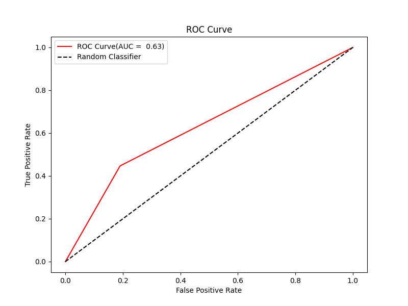
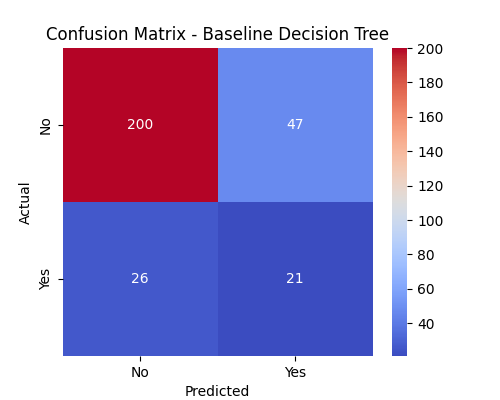

# 💼 IBM HR Analytics - Employee Attrition Predictor

🚀 **[Live Streamlit Demo](YOUR_STREAMLIT_LINK)** — Try it yourself in the browser!  
📊 **[View Dataset](https://www.kaggle.com/datasets/pavansubhasht/ibm-hr-analytics-attrition-dataset)** — IBM HR Analytics Employee Attrition Dataset

---

## 📌 **Project Overview**
Every organization aims to retain its best talent.  
However, predicting **who is likely to leave** is a challenge that requires **data-driven decision-making**.  

In this project, I built a **Decision Tree Classifier** that predicts whether an employee will leave the company based on various HR parameters.  
The goal was **not only** to achieve good accuracy, but also to make the model **interpretable** for HR professionals.  

This is my **third deployed ML project** after working on Linear Regression and Logistic Regression models — and my first **Decision Tree deployment**.

---

## 🎯 **Objectives**
- Analyze IBM's HR dataset to understand factors influencing employee attrition.
- Build a **predictive model** with a focus on:
  - **Accuracy**
  - **Interpretability**
  - **Practical HR insights**
- Deploy an **interactive web app** that HR managers can use instantly.
- Visualize **key patterns** through feature importance, ROC curves, and confusion matrices.

---

## 🛠 **Tech Stack**
| Component  | Technology |
|------------|------------|
| **Language** | Python 🐍 |
| **Data Analysis** | Pandas, Numpy |
| **Visualization** | Matplotlib, Seaborn |
| **Modeling** | Scikit-learn (DecisionTreeClassifier, SMOTE) |
| **Deployment** | Streamlit Cloud ☁️ |
| **Version Control** | Git + GitHub |

---

## 📂 **Dataset Details**
- **Source:** IBM HR Analytics Employee Attrition Dataset (Kaggle)
- **Rows:** 1,470  
- **Columns:** 35 (demographics, job role, satisfaction scores, etc.)
- **Target Variable:** `Attrition` (Yes / No)
- **Imbalance:** 1,233 "No" vs 237 "Yes" → Required balancing with SMOTE.

---

## 📊 **Model Performance**
- **Baseline Decision Tree Accuracy:** `75%`
- **ROC AUC Score:** `0.63`
- **Precision (Yes):** _fill value_  
- **Recall (Yes):** _fill value_  
- **F1-score (Yes):** _fill value_  

| Metric       | Value  |
|--------------|--------|
| Accuracy     | 75%    |
| ROC AUC      | 0.63   |
| Precision    | _fill_ |
| Recall       | _fill_ |
| F1-score     | _fill_ |

---

## 🔍 **Modeling Process**
### 1️⃣ **Data Preprocessing**
- Checked for missing/duplicate values — none found.
- Removed outliers using the **IQR method** (on training data only to avoid leakage).
- Balanced classes with **SMOTE**.
- Applied **Label Encoding** to categorical variables, saving encoders for deployment.

### 2️⃣ **Model Selection**
- Started with **DecisionTreeClassifier(random_state=42)**.
- Tried tuning with **GridSearchCV** (varied `max_depth`, `criterion`, `min_samples_split`).
- Discovered the **baseline** outperformed tuned models in recall for "Yes" class.

### 3️⃣ **Key Learning**
> Hyperparameter tuning isn’t always the magic bullet.  
> Simpler models can work better — especially when the dataset size is small and interpretability is key.

### 4️⃣ **Interpretability**
- Extracted **top decision rules** for HR managers.
- Plotted **feature importance** to identify key drivers of attrition.

---

## 📸 **Visual Insights**
_All images are stored in the [`Screenshots`](./Screenshots) folder._

**1️⃣ Feature Importance**  


**2️⃣ ROC Curve**  


**3️⃣ Confusion Matrix Heatmap**  


---

## 🌐 **Live App**
🎯 Try the app here → **[Streamlit Deployment Link](YOUR_STREAMLIT_LINK)**

---

## 📚 **Lessons Learned**
1. **Data leakage prevention** is critical — outlier removal & scaling should only be done on training data.
2. **Baseline models** are valuable benchmarks.
3. **Business value > pure accuracy** — HR teams need **clear reasons**, not black-box predictions.
4. Streamlit makes it easy to go from a Jupyter Notebook to a **shareable app**.

---

## 💻 **Run Locally**
```bash
# Clone repo
git clone https://github.com/YOUR-USERNAME/ibm-hr-attrition-predictor.git
cd ibm-hr-attrition-predictor

# Install dependencies
pip install -r requirements.txt

# Run Streamlit app
streamlit run app.py
